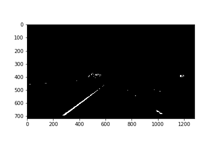

# Project.2 Advanced Lane Finding 

###### tags: `udacity` `自動運転`

---

The goals / steps of this project are the following:

* Compute the camera calibration matrix and distortion coefficients given a set of chessboard images.
* Apply a distortion correction to raw images.
* Use color transforms, gradients, etc., to create a thresholded binary image.
* Apply a perspective transform to rectify binary image ("birds-eye view").
* Detect lane pixels and fit to find the lane boundary.
* Determine the curvature of the lane and vehicle position with respect to center.
* Warp the detected lane boundaries back onto the original image.
* Output visual display of the lane boundaries and numerical estimation of lane curvature and vehicle position.

## [Rubric](https://review.udacity.com/#!/rubrics/571/view) Points

### Here I will consider the rubric points individually and describe how I addressed each point in my implementation.  

---

### Writeup / README

#### 1. Provide a Writeup / README that includes all the rubric points and how you addressed each one.  You can submit your writeup as markdown or pdf.  [Here](https://github.com/udacity/CarND-Advanced-Lane-Lines/blob/master/writeup_template.md) is a template writeup for this project you can use as a guide and a starting point.  

You're reading it!

All code I implemented is placed at "`utils.py`"

### Camera Calibration

#### 1. Briefly state how you computed the camera matrix and distortion coefficients. Provide an example of a distortion corrected calibration image.

Displays the original chessboard image. This chessboard has nine corners in the x-axis and six grounds in the y-axis.

To detect the corners present on a chessboard, first convert the original image to grayscale and apply the function `cv2.findChessboardCorners()` to the converted image.


The detected corner is displayed on the original image. You can see that the colorful lines and the corresponding corners are correctly detected.


Apply the function `cv2.undistort()` to the original image, using the camera matrix and distortion coefficients.

In the original image, the lines on the chessboard were distorted at the edges of the image, but after correcting the distortion, you can see that the distorted lines could be corrected to straight lines.


### Pipeline (single images)

#### 1. Provide an example of a distortion-corrected image.

Here, we will construct a lane detection algorithm for images that are straight and contain yellow and white lanes.


Using the camera matrix and the distortion coefficient obtained using the chessboard to correct the distortion of the original image, the distortion near the edge of the image is corrected, as shown in the following image.


#### 2. Describe how (and identify where in your code) you used color transforms, gradients or other methods to create a thresholded binary image.  Provide an example of a binary image result.

Now, let's apply the binarization processing to the image after distortion correction.

First, convert the image to grayscale, then apply Sobel FIlter in both the x and y directions.

After calculating the gradient of the image, the negative value is corrected with the absolute value, and then the normalization process is performed so that the value of the image falls within the range of 0 to 255.


Apply two thresholds to the resulting image gradient, using the minimum and maximum values.


Next, the magnitude of the gradient is calculated from the gradient in the x direction and the gradient in the y direction, and two threshold processes are performed using the minimum and maximum values.


Next, convert the image to HLS format and use the S channel for lane detection.

Since the S channel can supplement both the yellow and white lanes, it is binarized.


Next, convert the image to HSV format, set the upper and lower limits of color, and extract only the pixels included in the range.

This time, the upper and lower limits of each HSV value are set so that the yellow lane and the white lane can be detected.




Finally, combine the binarized images obtained by each threshold processing to obtain the final binarized image.

```python
binary = np.zeros_like(hsv_range_binary)
binary[((sx_binary == 1) & (sy_binary == 1) & (smag_binary == 1)) | 
       (hls_sch_binary == 1) | 
       (hsv_range_binary == 1)] = 1
```


#### 3. Describe how (and identify where in your code) you performed a perspective transform and provide an example of a transformed image.

In order to convert the image into a bird's-eye view, a perspective transformation is applied to the binarized image obtained last.


This resulted in the following source and destination points:

| Source        | Destination   | 
|:-------------:|:-------------:| 
| 600, 460      | 200, 0        | 
| 250, 720      | 200, 720      |
| 1150, 720     | 1080, 720     |
| 720, 460      | 1080, 0       |


#### 4. Describe how (and identify where in your code) you identified lane-line pixels and fit their positions with a polynomial?

The function created in utils.py is used to detect the location of the lane in the image where the lane is binarized.

**utils.get_leftx_rightx_base**

First, in order to determine the initial position of the search window, the histogram of the lower half of the image is calculated, and the position where the value becomes the maximum is the first x-coordinate value.

**utils.get_left_right_lane_xy**

Next, calculate the lane position while gradually lowering the y-coordinate of the search window.

In the function, parameters such as the number of search windows, detection width, and the minimum number of detection pixels are set.

**utils.get_lane_line_coefficients**

Next, based on the detected positions of the left and right lanes, calculate the coefficients for each curve.

**utils.get_lane_line_position**

Finally, based on the coefficient of the curve and the y coordinate of the image, calculate the x coordinate corresponding to the curve.

The approximate position of the lane has been detected.

![alt text][output_images/lane_line_warped_detect_line.png]


#### 5. Describe how (and identify where in your code) you calculated the radius of curvature of the lane and the position of the vehicle with respect to center.

**utils.get_lane_curvature**

The curvature of the curve is calculated based on the coefficient of the curve and the normalized distance in real space.

As shown in the example, it is assumed that the length of the entire y-coordinate is about 30 meters and the width of the lane is about 3.7 meters.

```python
ym_per_pix = 30/720 # meters per pixel in y dimension
xm_per_pix = 3.7/700 # meters per pixel in x dimension
    
y_eval = np.max(ploty)

left_curverad = ((1 + (2*left_fit[0]*y_eval*ym_per_pix + left_fit[1])**2)**1.5) / np.absolute(2*left_fit[0])
right_curverad = ((1 + (2*right_fit[0]*y_eval*ym_per_pix + right_fit[1])**2)**1.5) / np.absolute(2*right_fit[0])
```


#### 6. Provide an example image of your result plotted back down onto the road such that the lane area is identified clearly.

Since the detected lane position is obtained only for the perspective-transformed image, the perspective transformation is performed again to convert the image to the image from the original viewpoint.


---

### Pipeline (video)

#### 1. Provide a link to your final video output.  Your pipeline should perform reasonably well on the entire project video (wobbly lines are ok but no catastrophic failures that would cause the car to drive off the road!).

Finally, we will apply a continuous lane detection algorithm to the video.

This time, using the function of `OpenCV`, we get the image from the video and convert the processed image to a video.

The code used is the function `create_video()` in the `utils.py` file.


Here's a [link to my video result](project_output.avi)

Here's a [link to my challenge video result](challenge_output.avi)

Here's a [link to my harder-challenge video result](harder_challenge_output.avi)

---

### Discussion

#### 1. Briefly discuss any problems / issues you faced in your implementation of this project.  Where will your pipeline likely fail?  What could you do to make it more robust?

- Since the image used when creating the algorithm was a straight lane, the lane cannot be detected correctly, for example, at the moment when the car approaches a curve.
- The upper and lower limits used for color detection are values determined by sampling several images and do not work well for sun shadows or roads with different backgrounds

